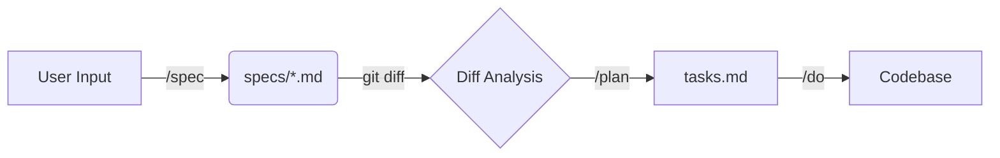

# Fractal Spec (分形规范)

> **Infinite Depth, Atomic Precision.**
> 
> Fractal Spec 是一个基于**分形架构**的软件规范管理系统。它通过强制执行严格的结构、原子化命名和无限层级拆分，确保随着项目复杂度的增加，文档依然保持清晰、模块化且高度可索引。

## 核心理念 (Core Philosophy)

传统的文档往往随着项目变大而腐烂。Fractal Spec 通过以下原则解决此问题：

1.  **分形生长**: 任何一个 Spec 文件在变得过大（>300行）时，都可以分裂出子 Spec，保持结构的自相似性。
2.  **原子化命名**: 每个节点（文件名片段）必须是单英文单词，杜绝模糊性。
3.  **Spec-Driven**: 代码是 Spec 的投影。Spec 变动驱动代码变动。

---

## 工作流 (The Workflow)

Fractal Spec 采用 **Spec -> Plan -> Do** 的闭环工作流，深度结合 Git 状态管理。



### 1. `/spec` (Define)
**定义与架构**

接收用户需求，按照 `fspec.md` 定义的严格规则（6段式结构、单单词命名），编写或更新 `specs/` 目录下的规范文件。

*   **原则**: 此时不关注代码细节，只关注业务逻辑、接口契约和系统行为。
*   **产物**: 修改后的 `specs/spec-*.md` 文件。

### 2. `/plan` (Design)
**基于差异的规划**

这是本工作流的核心。`/plan` 命令**不依赖**用户的口头重述，而是直接分析 **Spec 的 Git Diff**。

*   **逻辑**: "Spec 里的变动意味着什么代码改动？"
*   **动作**:
    1.  读取 `specs/` 下未 commit 的变动（或对比上一版本）。
    2.  分析变动波及的代码范围。
    3.  生成一份详细的执行计划，并写入持久化的任务文件（如 `tasks.md`）。
*   **产物**: `tasks.md` (包含具体的 Todo List、涉及文件、验证步骤)。

### 3. `/do` (Implement)
**执行与验证**

根据 `/plan` 生成的 `tasks.md`，自动化执行代码修改。

*   **逻辑**: 逐项执行任务，每完成一项即更新 `tasks.md` 状态。
*   **验证**: 执行 Spec 中定义的测试策略（Section 6: Verification）。

---

## 目录结构 (Structure)

```text
.
├── fspec.md                # [元规范] 管理 specs 的最高宪法，定义了所有规则
├── specs/                  # [规范库] 所有的业务规范都在这里
│   ├── spec-runtime.md     # 一级 Spec
│   ├── spec-runtime-io.md  # 二级 Spec (runtime 的子节点)
│   └── ...
├── tasks.md                # [工作区] 当前正在执行的计划 (由 /plan 生成)
└── README.md               # 本文件
```

## 命令参考 (Commands)

| 命令 | 描述 | 触发逻辑 |
| :--- | :--- | :--- |
| `/spec <requirement>` | 将需求转化为 Spec 文档 | 读取 `fspec.md` -> 写入 `specs/*.md` |
| `/plan` | 生成实施计划 | `git diff specs/` -> 分析影响 -> 写入 `tasks.md` |
| `/do` | 执行代码实现 | 读取 `tasks.md` -> 修改代码 -> 运行测试 |

## 快速开始 (Quick Start)

1.  **初始化**:
    确保项目根目录下存在 `fspec.md`（元规范）。

2.  **创建第一个 Spec**:
    ```bash
    /spec "我们需要一个高性能的日志系统，支持文件轮转和多级别过滤"
    ```
    *Agent 将创建 `specs/spec-logger.md`。*

3.  **生成计划**:
    ```bash
    /plan
    ```
    *Agent 分析 `specs/spec-logger.md` 的新增内容，生成 `tasks.md`。*

4.  **执行代码**:
    ```bash
    /do
    ```
    *Agent 根据 `tasks.md` 创建代码文件、配置文件并编写测试。*

5.  **迭代**:
    如果日志系统需要增加 "云端上传" 功能：
    *   `/spec "增加 S3 上传支持"` -> 更新 `spec-logger.md` (或拆分出 `spec-logger-cloud.md`)。
    *   `/plan` -> 分析 Diff，生成新任务。
    *   `/do` -> 实现功能。

---

## 最佳实践 (Best Practices)

1.  **Spec First**: 严禁跳过 `/spec` 直接写代码。Spec 是唯一的真理来源。
2.  **原子化提交**: 建议在 `/spec` 完成后 Commit 一次，`/do` 完成后 Commit 一次。这样 Git Log 清晰地记录了“需求变更”与“代码实现”的对应关系。
3.  **信任 Diff**: `/plan` 的质量取决于 Spec 描述的精准度。如果 Spec 模糊，Plan 就会产生幻觉。
4.  **分形拆分**: 当一个 Spec 变得太长，**立即**使用标准流程将其拆分为子文件。不要让单个文档成为维护瓶颈。
